## 项目说明

云题库SaaS平台，是一款采用SaaS模式搭建的在线教育类平台。

## 功能大概

1、会员管理

包含功能有会员分组、会员积分、多端会员、订单模块、线索追踪等。

2、考试模块

包含功能有试题分类、试题标签、试题组卷、单选试题、多选试题、问答试题、题海库、积分模块等。

3、信息资讯

包含功能有信息分类、信息标签、信息维护、积分模块等。

4、知识付费

包含功能有电子书教程、资源付费模块、积分模块、积分模块、在线直播、视频模块等。

5、营销活动

包含功能有会员拉新、营销促活、积分模块等。

6、系统配置

包含功能有业务端轮播图自动化配置、业务端菜单自动化配置、文件OSS管理模块、单文配置、开发配置等。

## 部分功能截图

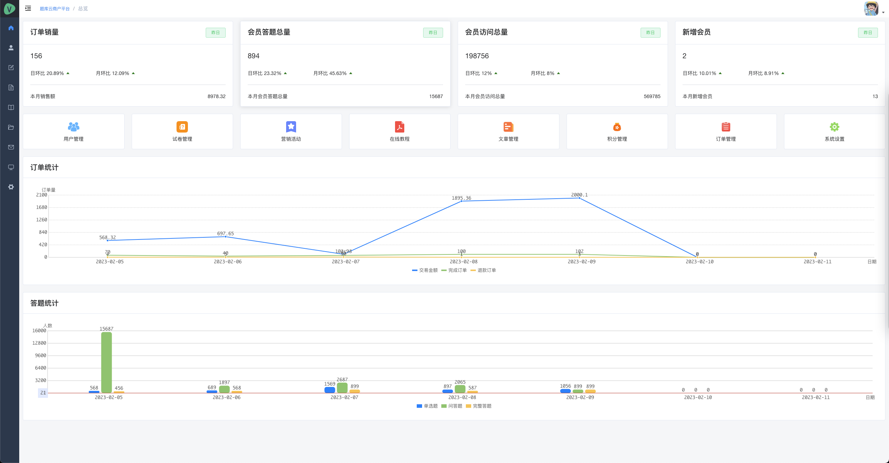

### 会员模块

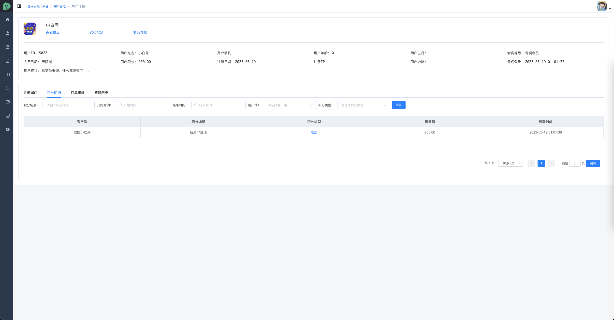
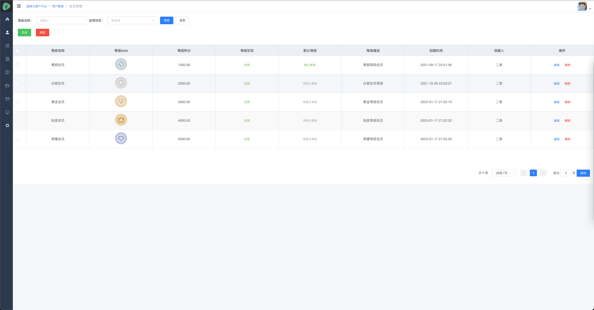

### 考试模块

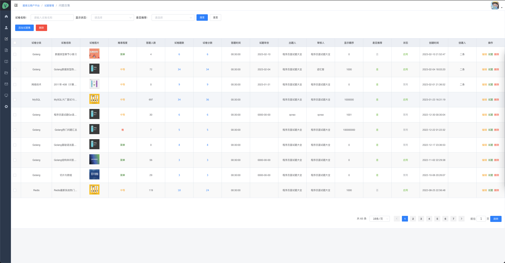
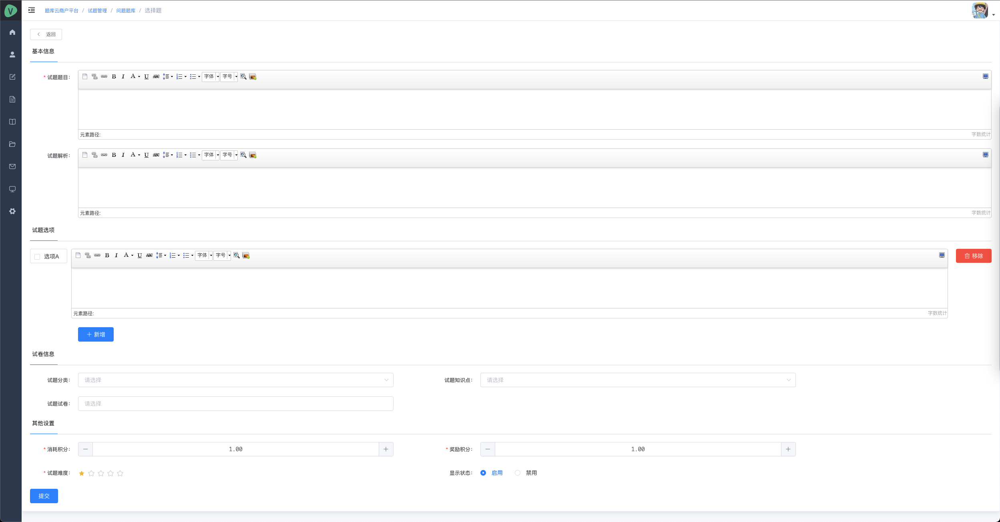
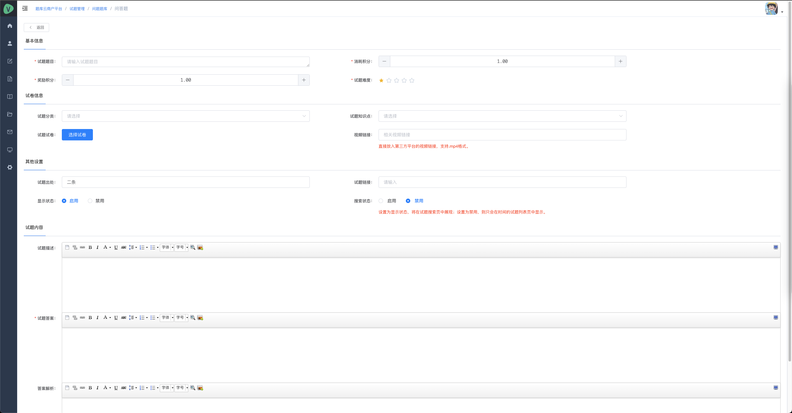

### 知识付费

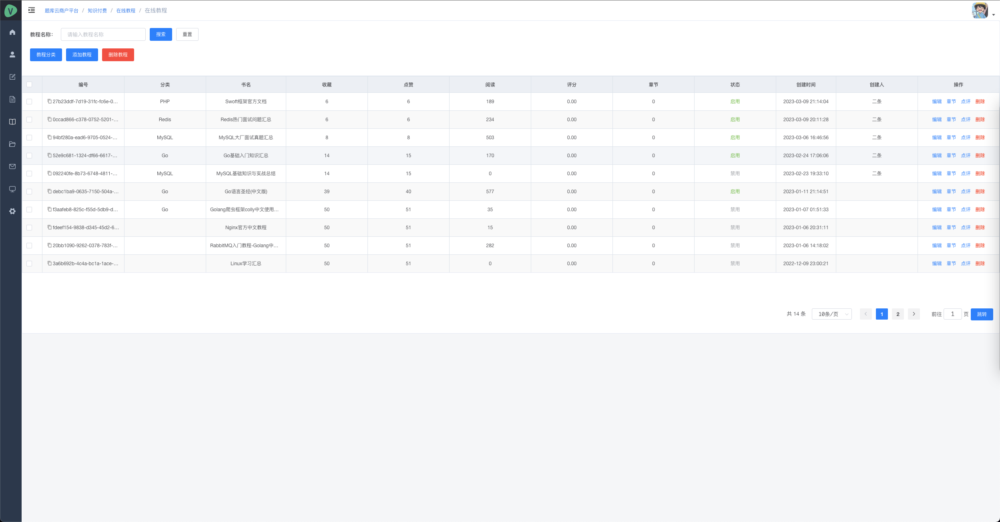
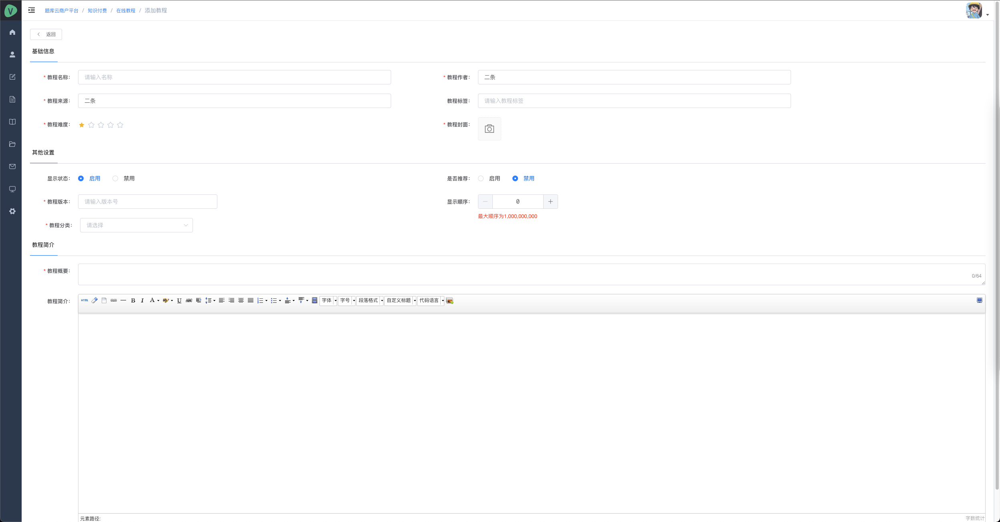
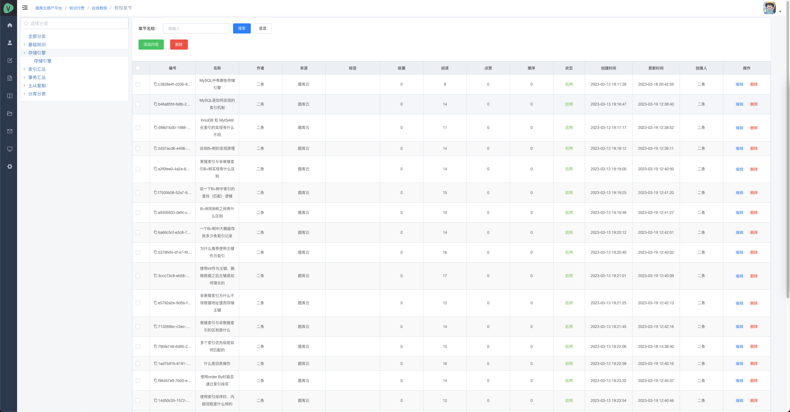
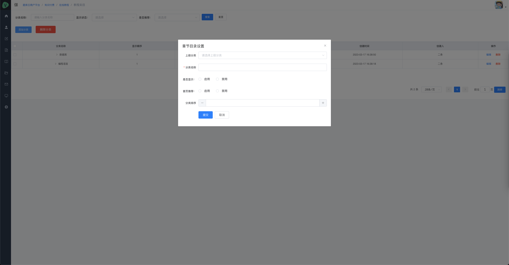
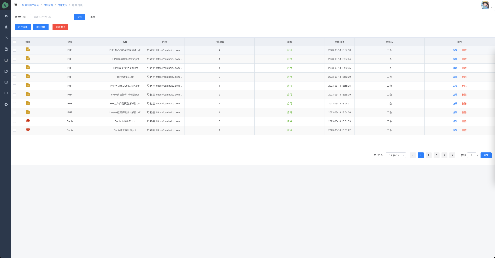
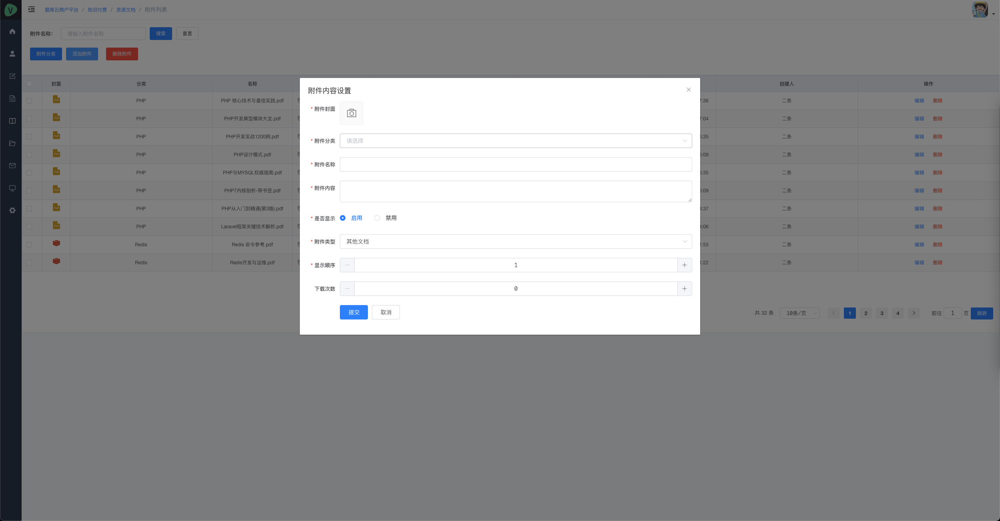

### 系统配置

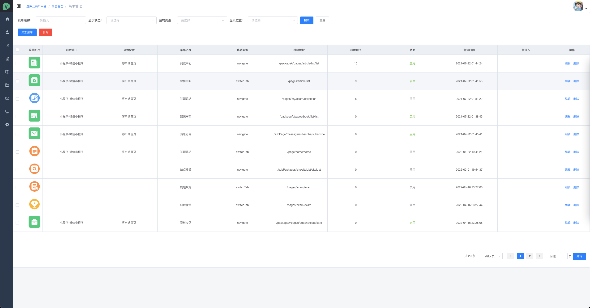
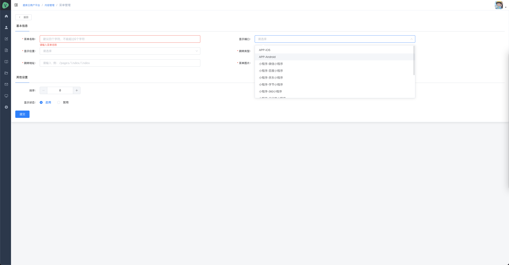
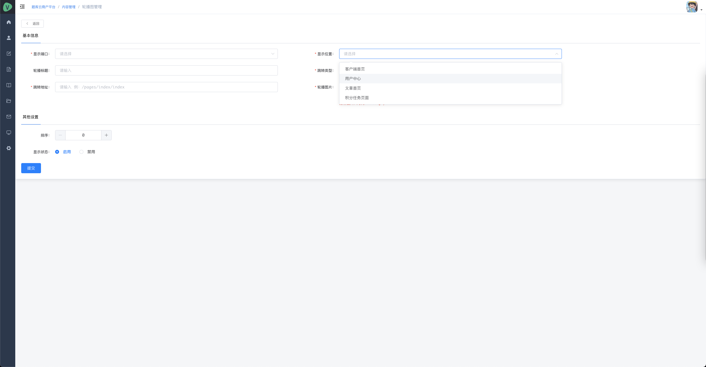
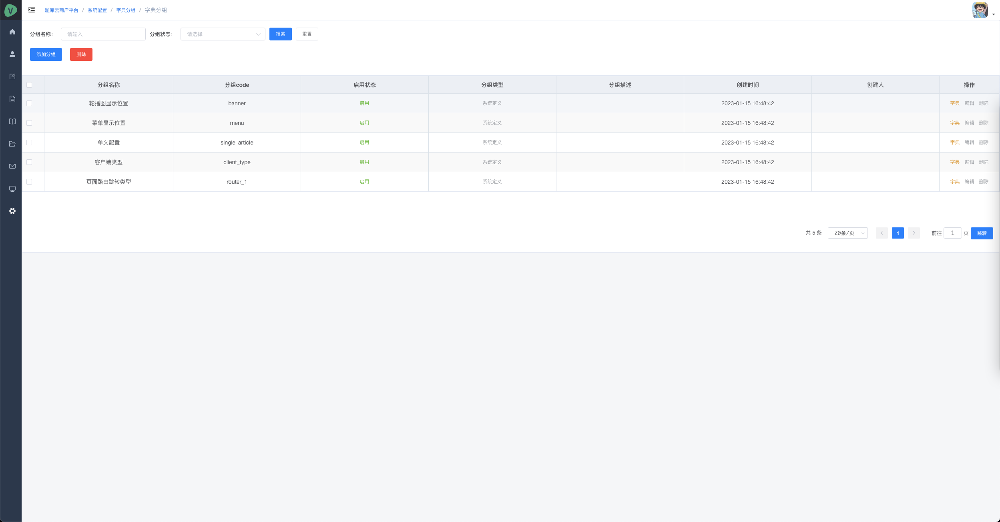
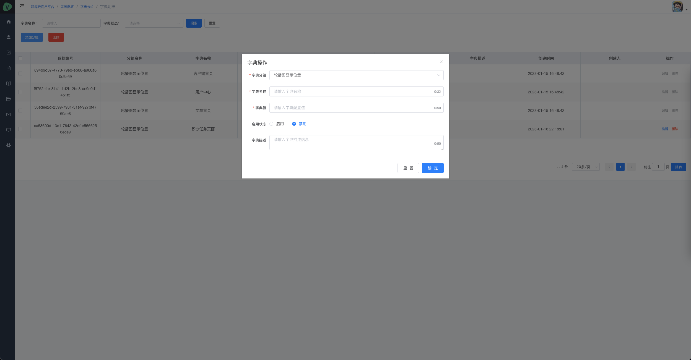